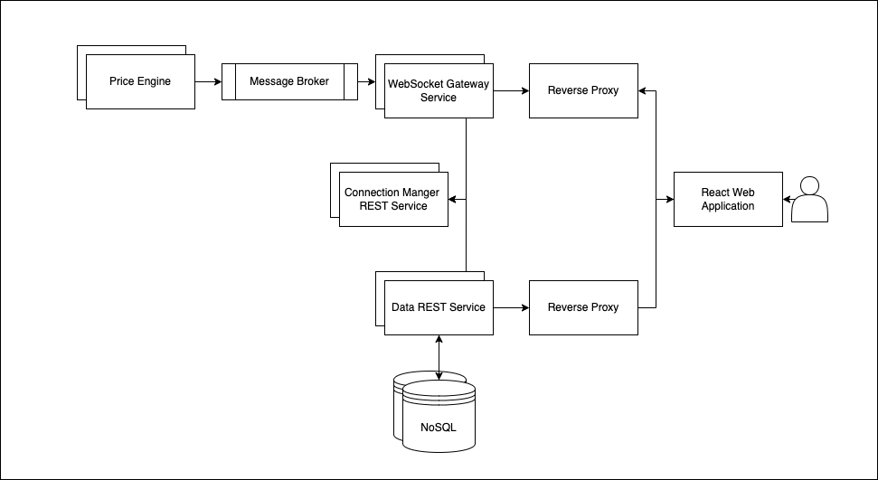

# FX Trader Service

# Components
## WebSocket Gateway
- [**Codebase Link**](./trading-service/trader/gateway)
- Languages/Frameworks: Python/WebSockets

Horizontally scalable microservice that creates and holds a web socket connection to the ui when user opens the web application.
The web socket serves as the price line to the client, allowing the client to receive prices for various FX crosses

- Holds downstream connections to the Price Engines and Upstream WebSocket connections to client
- Subscribs client line to Price Engine based when Connection Manager REST Service receives a request

On Start Up
- Subscribes to Pricing Engines
- Spins up Web Socket server and awaits client connections
- Spins up Connection Manager REST Service that waits on requests for quote

## Trader Core REST Service
- [**Codebase Link**](./trading-service/trader/data)
- Languages/Frameworks: Python

Horizontally scalable microservice for accounts and positions

- Persists positions & account updates to DB
- Fetches position & account updates from DB

## Connection Manager REST Service
- [**Codebase Link**](./trading-service/trader/gateway/service)
- Languages/Frameworks: Python

Horizontally scalable microservice for price subscriptions

- Notifies Gateway Service to subscribe/unsubscribe client line to pricing

## ReactJS Web Application
- Codebase: 
- Languages/Frameworks: TypeScript/TailwindCSS/ReactJS

Simple ReactJS application

## Price Generator
- [**Codebase Link**](./trading-service/trader/pricing)
- Languages/Frameworks: Python
  
At the moment this is a random number generator.

- Accepts a high, low and scale factor and generates prices within those bounds
- Handles subscribe and unsubscribe requests
